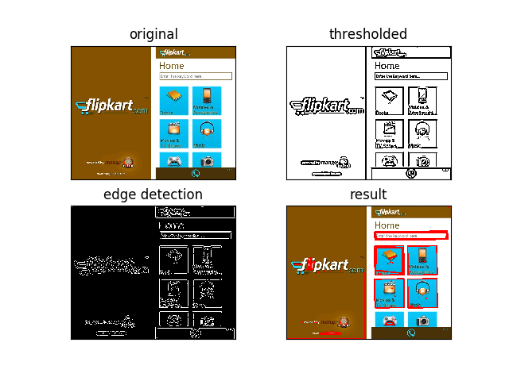

## Imager
### Image processing pipeline to detect form fields

Imager takes in an image and tries to identify form fields in the image. It currently works by looking for rectangles and marking them with a red border. 
There are many false positives, which will be filtered out in future versions. 

The implementation consists of several steps of pre-processing the image. 
 - load the image
 - convert to grayscale
 - blur the image
 - adaptively threshold the image
 - optionally use edge detection (not being used in the script)
 - find contours in the image
 - approximate the contour to see if it represents a rectangle
 - draw the rectangles found

### Immediate improvements:
 - filter out the contours below a certain threshold
 - experiment with thresholding techniques
 - implement checks to discard double detection (eg by comparing centroids of contours)
 - intelligently choose the number of contours to reject

### Possible feature additions
 - implement techniques to identify potential hyperlinks
 - implement OCR to _read_ the labels in form fields

### Requirements
 - OpenCV

________

__WARNING: This is the first version, cannot be used in production__

________
